# WHATtodo 기술 아키텍처 다이어그램

---

**문서 버전:** 1.0
**작성일:** 2025-11-26
**프로젝트명:** WHATtodo

---

## 목차

1. [시스템 아키텍처 개요](#1-시스템-아키텍처-개요)
2. [계층별 구조](#2-계층별-구조)
3. [데이터 플로우](#3-데이터-플로우)
4. [인증 플로우](#4-인증-플로우)
5. [배포 아키텍처](#5-배포-아키텍처)
6. [데이터베이스 구조](#6-데이터베이스-구조)

---

## 1. 시스템 아키텍처 개요

### 1.1 전체 시스템 구조

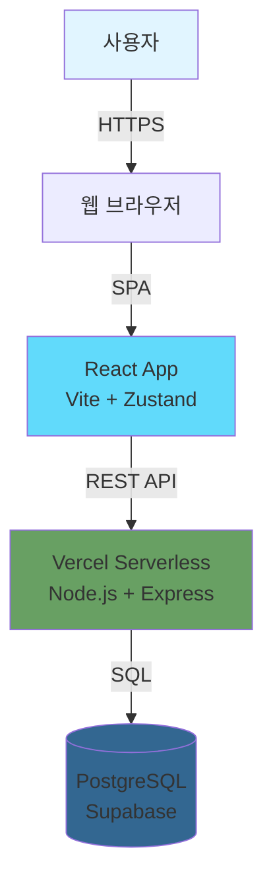

**계층 설명:**
- **프론트엔드**: React + Vite + Zustand + Tailwind CSS
- **백엔드**: Node.js + Express (Vercel Serverless Functions)
- **데이터베이스**: PostgreSQL (Supabase)
- **통신**: REST API over HTTPS
- **인증**: JWT (Access Token + Refresh Token)

---

## 2. 계층별 구조

### 2.1 3계층 아키텍처

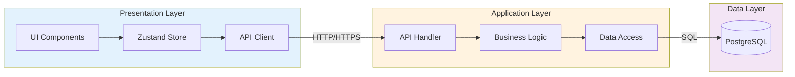

**책임 분리:**
- **Presentation**: UI 렌더링, 상태 관리, API 호출
- **Application**: 비즈니스 로직, 인증/인가, 데이터 검증
- **Data**: 데이터 영속성, 쿼리 실행, 무결성 보장

### 2.2 프론트엔드 구조

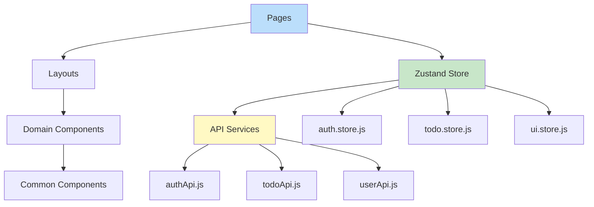

**디렉토리 구조:**
- `/pages` - 라우트 컴포넌트
- `/components/domain` - 도메인 특화 컴포넌트
- `/components/common` - 재사용 가능한 UI
- `/store` - Zustand 상태 관리
- `/api` - API 통신 계층

### 2.3 백엔드 구조

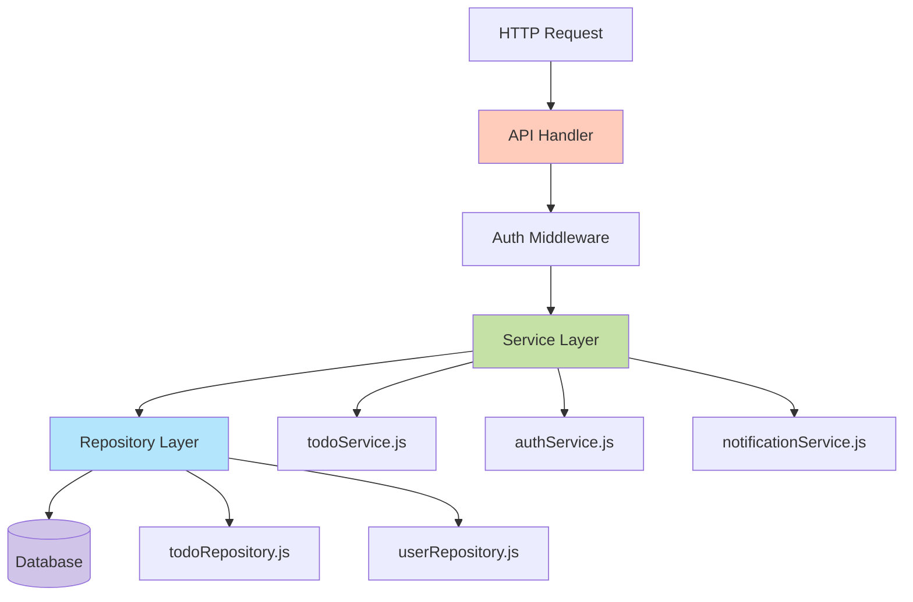

**Vercel Serverless 구조:**
- `/api/auth` - 인증 API
- `/api/todos` - 할일 API
- `/api/users` - 사용자 API
- `/api/_lib` - 공유 모듈 (서비스, 리포지토리, 미들웨어)

---

## 3. 데이터 플로우

### 3.1 할일 생성 플로우

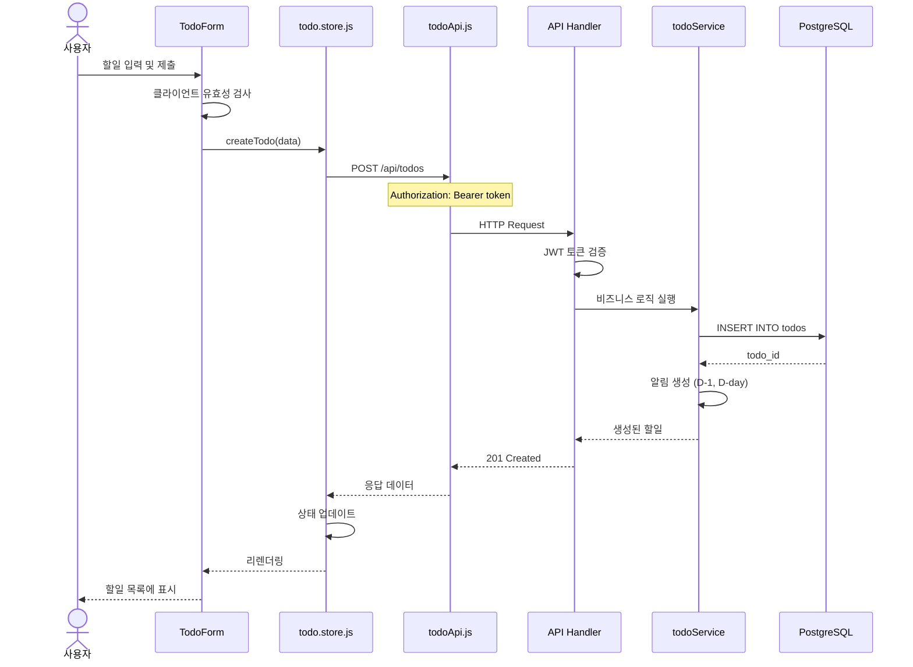

### 3.2 할일 조회 플로우

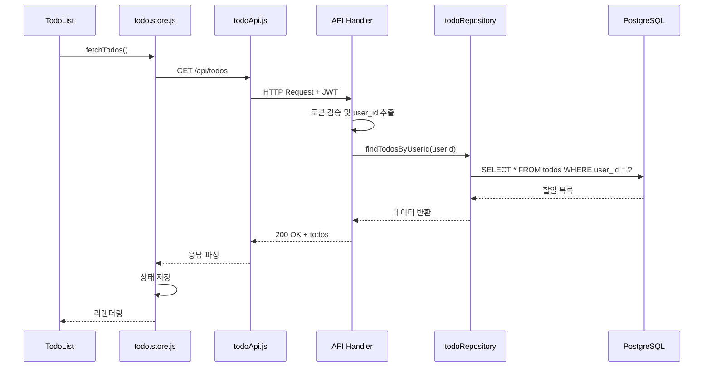

---

## 4. 인증 플로우

### 4.1 로그인 및 토큰 발급

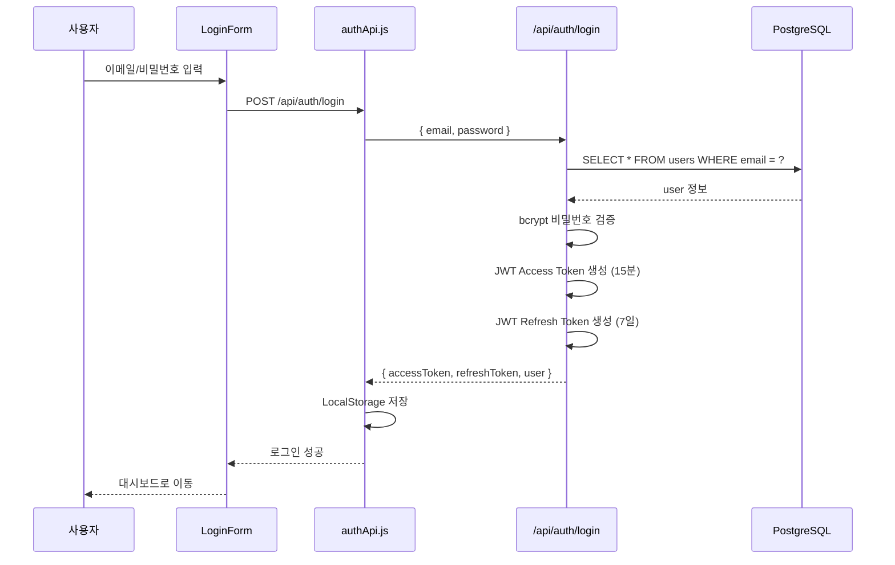

### 4.2 토큰 갱신 플로우

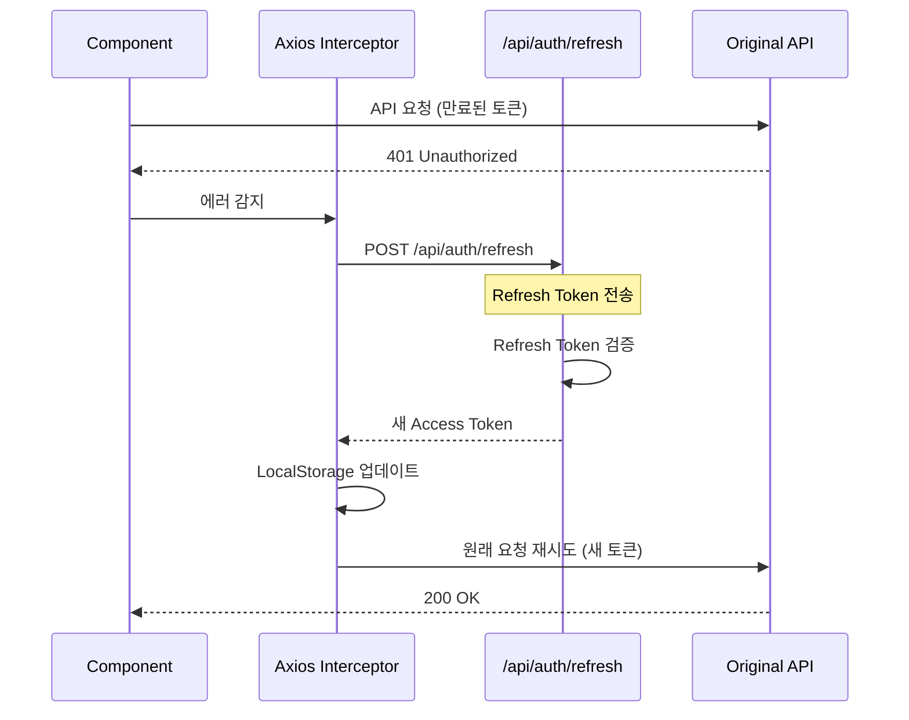

---

## 5. 배포 아키텍처

### 5.1 Vercel 배포 구조

```mermaid
graph TB
    subgraph Internet
        User[사용자]
    end

    subgraph Vercel["Vercel Platform"]
        CDN[Edge Network CDN]

        subgraph Frontend["Frontend (Static)"]
            ReactApp[React SPA<br/>Build Output]
            Assets[Static Assets]
        end

        subgraph Backend["Serverless Functions"]
            AuthFunc[/api/auth/*]
            TodoFunc[/api/todos/*]
            UserFunc[/api/users/*]
        end

        EnvVars[Environment Variables]
    end

    subgraph Supabase["Supabase Cloud"]
        PostgreSQL[(PostgreSQL)]
        Backup[Daily Backup]
    end

    User -->|HTTPS| CDN
    CDN --> ReactApp
    CDN --> Assets
    ReactApp -->|API Calls| AuthFunc
    ReactApp -->|API Calls| TodoFunc
    ReactApp -->|API Calls| UserFunc

    AuthFunc --> EnvVars
    TodoFunc --> EnvVars
    UserFunc --> EnvVars

    AuthFunc -->|Connection Pool| PostgreSQL
    TodoFunc -->|Connection Pool| PostgreSQL
    UserFunc -->|Connection Pool| PostgreSQL

    PostgreSQL --> Backup

    style CDN fill:#000000,color:#ffffff
    style ReactApp fill:#61dafb
    style PostgreSQL fill:#336791
    style EnvVars fill:#ffd54f
```

**배포 프로세스:**
1. 로컬에서 개발 및 테스트
2. Git commit & push to GitHub
3. Vercel 자동 빌드 및 배포
4. Edge Network CDN을 통한 전 세계 배포

**환경 변수:**
- **프론트엔드**: `VITE_API_URL`, `VITE_ENV`
- **백엔드**: `DATABASE_URL`, `JWT_SECRET`, `JWT_REFRESH_SECRET`

---

## 6. 데이터베이스 구조

### 6.1 ERD (Entity Relationship Diagram)

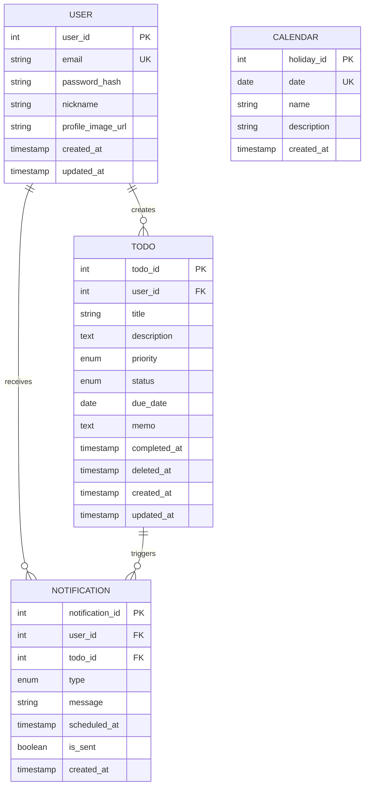

### 6.2 주요 인덱스

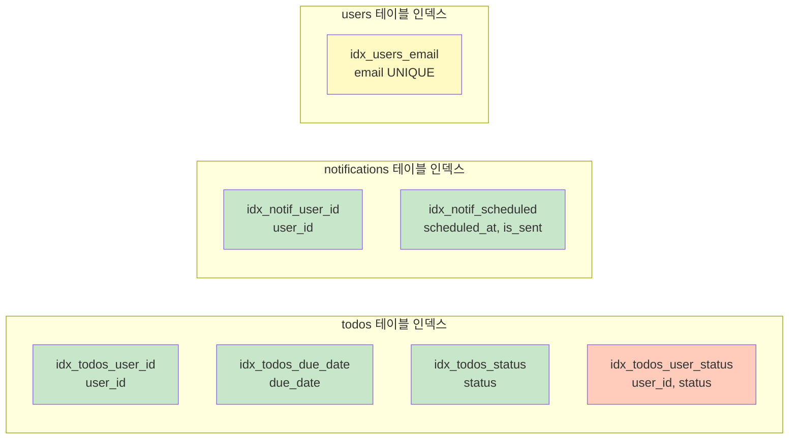

**인덱스 전략:**
- **단일 인덱스**: 자주 조회되는 단일 컬럼 (user_id, due_date, status)
- **복합 인덱스**: 함께 조회되는 컬럼 조합 (user_id + status)
- **유니크 인덱스**: 중복 방지 (email)

---

## 7. 보안 아키텍처

### 7.1 다층 보안 구조

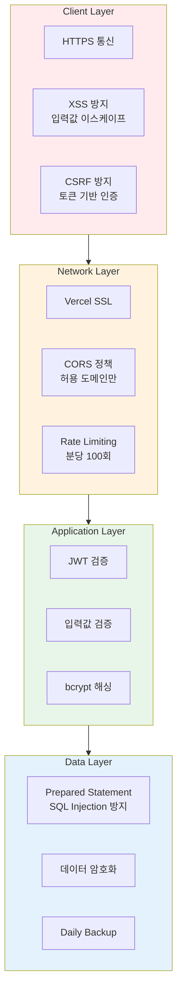

**보안 원칙:**
1. **통신 보안**: 모든 통신 HTTPS 암호화
2. **인증 보안**: JWT Access/Refresh Token, bcrypt 해싱
3. **입력값 검증**: 프론트엔드 + 백엔드 양단 검증
4. **데이터 보안**: Prepared Statement, 민감정보 암호화

---

## 8. 성능 최적화 전략

### 8.1 프론트엔드 최적화

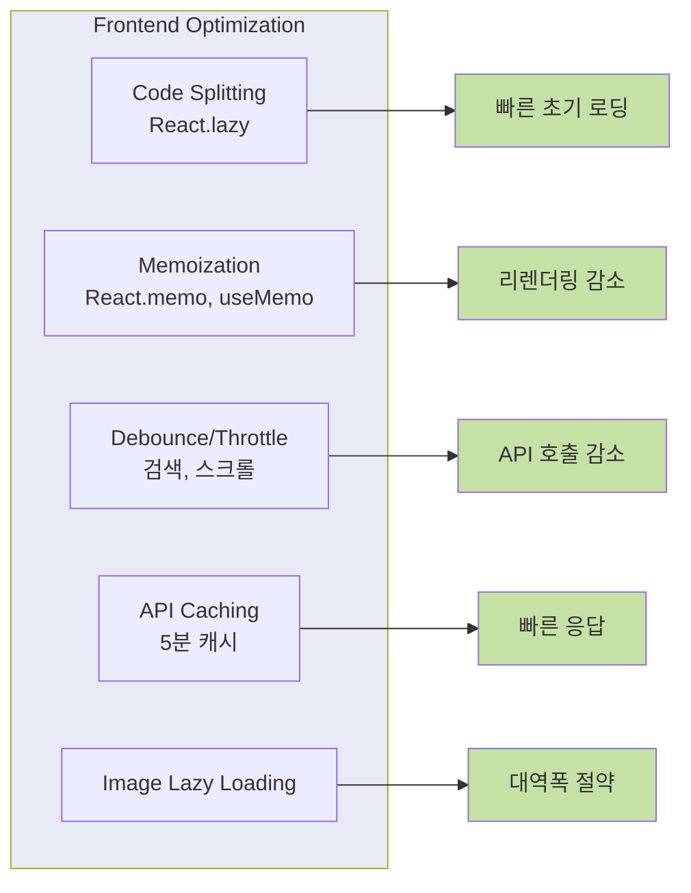

### 8.2 백엔드 최적화

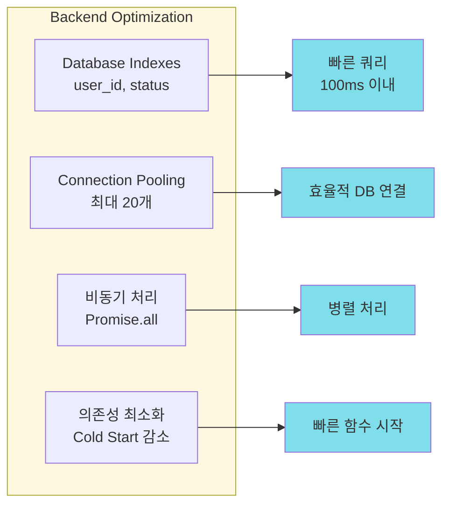

---

## 9. 아키텍처 결정 기록 (ADR)

### 9.1 주요 기술 선택 이유

| 기술 | 선택 이유 |
|-----|----------|
| **React** | 컴포넌트 기반 개발, 풍부한 생태계, 빠른 개발 속도 |
| **Vite** | 빠른 빌드, HMR, 최신 도구 |
| **Zustand** | 간단한 상태 관리, Redux보다 가벼움, 보일러플레이트 최소 |
| **Vercel Serverless** | 자동 스케일링, 배포 간편, 무료 티어, Cold Start 최적화 |
| **PostgreSQL (Supabase)** | 관계형 데이터, 무료 호스팅, 백업 자동화 |
| **JWT** | Stateless 인증, Serverless 환경 최적, 확장성 |

### 9.2 오버엔지니어링 회피 결정

**제외한 기술/패턴:**
- ❌ GraphQL → REST API로 충분 (MVP 단계)
- ❌ Redis 캐싱 → Vercel Edge Caching + 클라이언트 캐싱으로 충분
- ❌ 마이크로서비스 → 모놀리식 Serverless로 단순화
- ❌ TypeScript → JavaScript로 빠른 개발 (v1.1에서 도입 검토)
- ❌ 복잡한 상태 관리 (Redux Saga) → Zustand로 충분

---

## 문서 요약

이 아키텍처 다이어그램은 WHATtodo 프로젝트의 기술 구조를 시각화합니다.

**핵심 아키텍처:**
- 3계층 구조 (Presentation - Application - Data)
- 단방향 의존성 (Frontend → API → Database)
- Stateless Serverless 설계
- JWT 기반 인증
- HTTPS 보안 통신

**기술 스택:**
- Frontend: React + Vite + Zustand + Tailwind CSS
- Backend: Node.js + Express on Vercel Serverless
- Database: PostgreSQL on Supabase
- Deployment: Vercel (Frontend + Backend)

**설계 원칙:**
- 단순함 우선 (오버엔지니어링 금지)
- 보안 우선 (다층 보안)
- 성능 최적화 (캐싱, 인덱싱, 코드 스플리팅)
- 확장 가능성 (v1.1 이후 점진적 개선)

---

**문서 버전:** 1.0
**마지막 업데이트:** 2025-11-26
