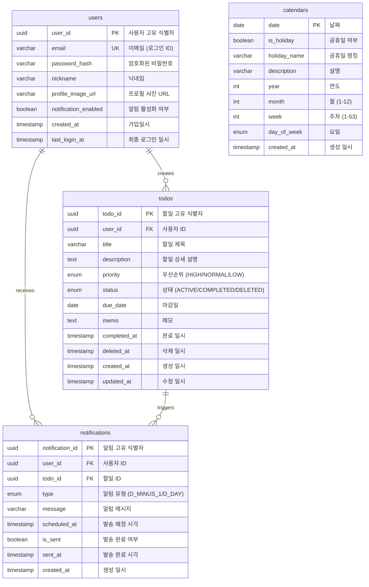

# WHATtodo ERD (Entity Relationship Diagram)

---

**문서 버전:** 1.0
**작성일:** 2025-11-26
**프로젝트명:** WHATtodo
**상태:** Draft

---

## 목차

1. [개요](#1-개요)
2. [ERD 다이어그램](#2-erd-다이어그램)
3. [엔티티 상세 명세](#3-엔티티-상세-명세)
4. [관계 설명](#4-관계-설명)
5. [인덱스 전략](#5-인덱스-전략)
6. [데이터 무결성 규칙](#6-데이터-무결성-규칙)
7. [샘플 데이터](#7-샘플-데이터)

---

## 1. 개요

### 1.1 데이터 모델 개요

WHATtodo 프로젝트는 사용자 인증 기반의 할일 관리 시스템으로, 다음 4개의 핵심 엔티티로 구성됩니다:

- **User (사용자)**: 사용자 계정 및 프로필 정보
- **Todo (할일)**: 사용자의 할일 항목
- **Notification (알림)**: 마감일 알림 정보
- **Calendar (캘린더)**: 공휴일 참조 데이터

### 1.2 데이터베이스 환경

| 항목 | 설명 |
|-----|------|
| **DBMS** | PostgreSQL 14+ |
| **호스팅** | Supabase |
| **ORM** | 미사용 (Raw SQL) |
| **문자셋** | UTF-8 |
| **타임존** | Asia/Seoul (KST) |
| **백업 주기** | 일일 자동 백업 (30일 보관) |

### 1.3 네이밍 컨벤션

- **테이블명**: 복수형, 소문자, 언더스코어 (예: `users`, `todos`, `notifications`)
- **컬럼명**: 단수형, 소문자, 언더스코어 (예: `user_id`, `created_at`)
- **인덱스명**: `idx_{테이블명}_{컬럼명}` (예: `idx_todos_user_id`)
- **외래키명**: `fk_{테이블명}_{참조테이블명}` (예: `fk_todos_users`)

---

## 2. ERD 다이어그램

### 2.1 전체 ERD



### 2.2 관계 요약

| 관계 | 설명 | 카디널리티 |
|-----|------|----------|
| **User → Todo** | 사용자는 여러 할일을 가질 수 있음 | 1 : N |
| **User → Notification** | 사용자는 여러 알림을 받을 수 있음 | 1 : N |
| **Todo → Notification** | 할일은 여러 알림을 생성할 수 있음 | 1 : N |
| **Calendar** | 독립 엔티티 (참조 데이터) | - |

---

## 3. 엔티티 상세 명세

### 3.1 users (사용자)

**목적**: 사용자 계정 및 프로필 정보 관리

#### 테이블 구조

```sql
CREATE TABLE users (
    user_id UUID PRIMARY KEY DEFAULT gen_random_uuid(),
    email VARCHAR(255) UNIQUE NOT NULL,
    password_hash VARCHAR(255) NOT NULL,
    nickname VARCHAR(50) NOT NULL,
    profile_image_url VARCHAR(500),
    notification_enabled BOOLEAN DEFAULT true,
    created_at TIMESTAMP DEFAULT CURRENT_TIMESTAMP,
    last_login_at TIMESTAMP,

    CONSTRAINT chk_email_format CHECK (email ~* '^[A-Za-z0-9._%+-]+@[A-Za-z0-9.-]+\.[A-Z|a-z]{2,}$'),
    CONSTRAINT chk_nickname_length CHECK (char_length(nickname) BETWEEN 2 AND 20)
);
```

#### 컬럼 명세

| 컬럼명 | 타입 | 제약조건 | 기본값 | 설명 |
|-------|------|---------|-------|------|
| `user_id` | UUID | PRIMARY KEY | gen_random_uuid() | 사용자 고유 식별자 |
| `email` | VARCHAR(255) | UNIQUE, NOT NULL | - | 이메일 (로그인 ID) |
| `password_hash` | VARCHAR(255) | NOT NULL | - | bcrypt 해시 비밀번호 |
| `nickname` | VARCHAR(50) | NOT NULL | - | 사용자 닉네임 (2-20자) |
| `profile_image_url` | VARCHAR(500) | NULL | NULL | 프로필 사진 URL |
| `notification_enabled` | BOOLEAN | NOT NULL | true | 알림 활성화 여부 |
| `created_at` | TIMESTAMP | NOT NULL | CURRENT_TIMESTAMP | 가입 일시 |
| `last_login_at` | TIMESTAMP | NULL | NULL | 최종 로그인 일시 |

#### 인덱스

```sql
CREATE UNIQUE INDEX idx_users_email ON users(email);
CREATE INDEX idx_users_created_at ON users(created_at);
```

---

### 3.2 todos (할일)

**목적**: 사용자의 할일 항목 관리

#### 테이블 구조

```sql
CREATE TYPE priority_enum AS ENUM ('HIGH', 'NORMAL', 'LOW');
CREATE TYPE status_enum AS ENUM ('ACTIVE', 'COMPLETED', 'DELETED');

CREATE TABLE todos (
    todo_id UUID PRIMARY KEY DEFAULT gen_random_uuid(),
    user_id UUID NOT NULL,
    title VARCHAR(100) NOT NULL,
    description TEXT,
    priority priority_enum DEFAULT 'NORMAL',
    status status_enum DEFAULT 'ACTIVE',
    due_date DATE,
    memo TEXT,
    completed_at TIMESTAMP,
    deleted_at TIMESTAMP,
    created_at TIMESTAMP DEFAULT CURRENT_TIMESTAMP,
    updated_at TIMESTAMP DEFAULT CURRENT_TIMESTAMP,

    CONSTRAINT fk_todos_users FOREIGN KEY (user_id) REFERENCES users(user_id) ON DELETE CASCADE,
    CONSTRAINT chk_title_length CHECK (char_length(title) BETWEEN 1 AND 100),
    CONSTRAINT chk_completed_status CHECK (
        (status = 'COMPLETED' AND completed_at IS NOT NULL) OR
        (status != 'COMPLETED' AND completed_at IS NULL)
    ),
    CONSTRAINT chk_deleted_status CHECK (
        (status = 'DELETED' AND deleted_at IS NOT NULL) OR
        (status != 'DELETED' AND deleted_at IS NULL)
    )
);
```

#### 컬럼 명세

| 컬럼명 | 타입 | 제약조건 | 기본값 | 설명 |
|-------|------|---------|-------|------|
| `todo_id` | UUID | PRIMARY KEY | gen_random_uuid() | 할일 고유 식별자 |
| `user_id` | UUID | FOREIGN KEY, NOT NULL | - | 사용자 ID |
| `title` | VARCHAR(100) | NOT NULL | - | 할일 제목 (1-100자) |
| `description` | TEXT | NULL | NULL | 할일 상세 설명 |
| `priority` | ENUM | NOT NULL | NORMAL | 우선순위 (HIGH/NORMAL/LOW) |
| `status` | ENUM | NOT NULL | ACTIVE | 상태 (ACTIVE/COMPLETED/DELETED) |
| `due_date` | DATE | NULL | NULL | 마감일 |
| `memo` | TEXT | NULL | NULL | 메모 |
| `completed_at` | TIMESTAMP | NULL | NULL | 완료 일시 |
| `deleted_at` | TIMESTAMP | NULL | NULL | 삭제 일시 |
| `created_at` | TIMESTAMP | NOT NULL | CURRENT_TIMESTAMP | 생성 일시 |
| `updated_at` | TIMESTAMP | NOT NULL | CURRENT_TIMESTAMP | 수정 일시 |

#### 인덱스

```sql
CREATE INDEX idx_todos_user_id ON todos(user_id);
CREATE INDEX idx_todos_due_date ON todos(due_date);
CREATE INDEX idx_todos_status ON todos(status);
CREATE INDEX idx_todos_user_status ON todos(user_id, status);
CREATE INDEX idx_todos_user_due_date ON todos(user_id, due_date);
CREATE INDEX idx_todos_deleted_at ON todos(deleted_at) WHERE status = 'DELETED';
```

#### 트리거 (자동 updated_at 갱신)

```sql
CREATE OR REPLACE FUNCTION update_updated_at_column()
RETURNS TRIGGER AS $$
BEGIN
    NEW.updated_at = CURRENT_TIMESTAMP;
    RETURN NEW;
END;
$$ LANGUAGE plpgsql;

CREATE TRIGGER trigger_todos_updated_at
    BEFORE UPDATE ON todos
    FOR EACH ROW
    EXECUTE FUNCTION update_updated_at_column();
```

---

### 3.3 notifications (알림)

**목적**: 할일 마감일 알림 관리

#### 테이블 구조

```sql
CREATE TYPE notification_type_enum AS ENUM ('D_MINUS_1', 'D_DAY');

CREATE TABLE notifications (
    notification_id UUID PRIMARY KEY DEFAULT gen_random_uuid(),
    user_id UUID NOT NULL,
    todo_id UUID NOT NULL,
    type notification_type_enum NOT NULL,
    message VARCHAR(500) NOT NULL,
    scheduled_at TIMESTAMP NOT NULL,
    is_sent BOOLEAN DEFAULT false,
    sent_at TIMESTAMP,
    created_at TIMESTAMP DEFAULT CURRENT_TIMESTAMP,

    CONSTRAINT fk_notifications_users FOREIGN KEY (user_id) REFERENCES users(user_id) ON DELETE CASCADE,
    CONSTRAINT fk_notifications_todos FOREIGN KEY (todo_id) REFERENCES todos(todo_id) ON DELETE CASCADE,
    CONSTRAINT chk_sent_consistency CHECK (
        (is_sent = true AND sent_at IS NOT NULL) OR
        (is_sent = false AND sent_at IS NULL)
    ),
    CONSTRAINT chk_scheduled_future CHECK (scheduled_at >= created_at)
);
```

#### 컬럼 명세

| 컬럼명 | 타입 | 제약조건 | 기본값 | 설명 |
|-------|------|---------|-------|------|
| `notification_id` | UUID | PRIMARY KEY | gen_random_uuid() | 알림 고유 식별자 |
| `user_id` | UUID | FOREIGN KEY, NOT NULL | - | 사용자 ID |
| `todo_id` | UUID | FOREIGN KEY, NOT NULL | - | 할일 ID |
| `type` | ENUM | NOT NULL | - | 알림 유형 (D_MINUS_1/D_DAY) |
| `message` | VARCHAR(500) | NOT NULL | - | 알림 메시지 |
| `scheduled_at` | TIMESTAMP | NOT NULL | - | 발송 예정 시각 |
| `is_sent` | BOOLEAN | NOT NULL | false | 발송 완료 여부 |
| `sent_at` | TIMESTAMP | NULL | NULL | 발송 완료 시각 |
| `created_at` | TIMESTAMP | NOT NULL | CURRENT_TIMESTAMP | 생성 일시 |

#### 인덱스

```sql
CREATE INDEX idx_notifications_user_id ON notifications(user_id);
CREATE INDEX idx_notifications_todo_id ON notifications(todo_id);
CREATE INDEX idx_notifications_scheduled_at ON notifications(scheduled_at, is_sent);
CREATE INDEX idx_notifications_pending ON notifications(scheduled_at) WHERE is_sent = false;
```

---

### 3.4 calendars (캘린더)

**목적**: 공휴일 참조 데이터 관리

#### 테이블 구조

```sql
CREATE TYPE day_of_week_enum AS ENUM ('MONDAY', 'TUESDAY', 'WEDNESDAY', 'THURSDAY', 'FRIDAY', 'SATURDAY', 'SUNDAY');

CREATE TABLE calendars (
    date DATE PRIMARY KEY,
    is_holiday BOOLEAN DEFAULT false,
    holiday_name VARCHAR(100),
    description VARCHAR(500),
    year INT NOT NULL,
    month INT NOT NULL,
    week INT NOT NULL,
    day_of_week day_of_week_enum NOT NULL,
    created_at TIMESTAMP DEFAULT CURRENT_TIMESTAMP,

    CONSTRAINT chk_month_range CHECK (month BETWEEN 1 AND 12),
    CONSTRAINT chk_week_range CHECK (week BETWEEN 1 AND 53),
    CONSTRAINT chk_holiday_name CHECK (
        (is_holiday = true AND holiday_name IS NOT NULL) OR
        (is_holiday = false)
    )
);
```

#### 컬럼 명세

| 컬럼명 | 타입 | 제약조건 | 기본값 | 설명 |
|-------|------|---------|-------|------|
| `date` | DATE | PRIMARY KEY | - | 날짜 |
| `is_holiday` | BOOLEAN | NOT NULL | false | 공휴일 여부 |
| `holiday_name` | VARCHAR(100) | NULL | NULL | 공휴일 명칭 |
| `description` | VARCHAR(500) | NULL | NULL | 설명 |
| `year` | INT | NOT NULL | - | 연도 |
| `month` | INT | NOT NULL | - | 월 (1-12) |
| `week` | INT | NOT NULL | - | 주차 (1-53) |
| `day_of_week` | ENUM | NOT NULL | - | 요일 |
| `created_at` | TIMESTAMP | NOT NULL | CURRENT_TIMESTAMP | 생성 일시 |

#### 인덱스

```sql
CREATE INDEX idx_calendars_year_month ON calendars(year, month);
CREATE INDEX idx_calendars_is_holiday ON calendars(is_holiday) WHERE is_holiday = true;
```

---

## 4. 관계 설명

### 4.1 User → Todo (1:N)

**관계 유형**: 소유 관계 (Ownership)

- 한 명의 사용자는 여러 개의 할일을 생성할 수 있습니다.
- 할일은 반드시 한 명의 사용자에게 속합니다.
- 사용자 삭제 시 관련 할일도 함께 삭제됩니다 (CASCADE).

**외래키 제약조건**:
```sql
CONSTRAINT fk_todos_users
    FOREIGN KEY (user_id)
    REFERENCES users(user_id)
    ON DELETE CASCADE
```

**조회 예시**:
```sql
-- 특정 사용자의 모든 활성 할일 조회
SELECT * FROM todos
WHERE user_id = ? AND status = 'ACTIVE'
ORDER BY due_date ASC, priority DESC;
```

---

### 4.2 User → Notification (1:N)

**관계 유형**: 수신 관계 (Receiving)

- 한 명의 사용자는 여러 개의 알림을 받을 수 있습니다.
- 알림은 반드시 한 명의 사용자에게 속합니다.
- 사용자 삭제 시 관련 알림도 함께 삭제됩니다 (CASCADE).

**외래키 제약조건**:
```sql
CONSTRAINT fk_notifications_users
    FOREIGN KEY (user_id)
    REFERENCES users(user_id)
    ON DELETE CASCADE
```

**조회 예시**:
```sql
-- 특정 사용자의 미발송 알림 조회
SELECT * FROM notifications
WHERE user_id = ? AND is_sent = false
ORDER BY scheduled_at ASC;
```

---

### 4.3 Todo → Notification (1:N)

**관계 유형**: 트리거 관계 (Triggering)

- 한 개의 할일은 최대 2개의 알림을 생성합니다 (D-1, D-day).
- 알림은 반드시 한 개의 할일에 속합니다.
- 할일 삭제 시 관련 알림도 함께 삭제됩니다 (CASCADE).

**외래키 제약조건**:
```sql
CONSTRAINT fk_notifications_todos
    FOREIGN KEY (todo_id)
    REFERENCES todos(todo_id)
    ON DELETE CASCADE
```

**조회 예시**:
```sql
-- 특정 할일의 모든 알림 조회
SELECT * FROM notifications
WHERE todo_id = ?
ORDER BY scheduled_at ASC;
```

---

### 4.4 Calendar (독립 엔티티)

**관계 유형**: 참조 데이터 (Reference Data)

- 다른 엔티티와 직접적인 외래키 관계가 없습니다.
- 시스템 전체에서 공통으로 참조하는 데이터입니다.
- 공휴일 정보를 제공합니다.

**조회 예시**:
```sql
-- 특정 월의 공휴일 조회
SELECT date, holiday_name FROM calendars
WHERE year = 2025 AND month = 11 AND is_holiday = true
ORDER BY date;
```

---

## 5. 인덱스 전략

### 5.1 인덱스 목록

| 테이블 | 인덱스명 | 컬럼 | 타입 | 목적 |
|-------|---------|------|-----|------|
| **users** | `idx_users_email` | email | UNIQUE | 로그인 조회, 중복 방지 |
| **users** | `idx_users_created_at` | created_at | INDEX | 가입자 통계 조회 |
| **todos** | `idx_todos_user_id` | user_id | INDEX | 사용자별 할일 조회 |
| **todos** | `idx_todos_due_date` | due_date | INDEX | 마감일순 정렬 |
| **todos** | `idx_todos_status` | status | INDEX | 상태별 필터링 |
| **todos** | `idx_todos_user_status` | user_id, status | COMPOSITE | 사용자+상태 조회 최적화 |
| **todos** | `idx_todos_user_due_date` | user_id, due_date | COMPOSITE | 사용자+마감일 조회 최적화 |
| **todos** | `idx_todos_deleted_at` | deleted_at (PARTIAL) | PARTIAL | 휴지통 자동 정리 |
| **notifications** | `idx_notifications_user_id` | user_id | INDEX | 사용자별 알림 조회 |
| **notifications** | `idx_notifications_todo_id` | todo_id | INDEX | 할일별 알림 조회 |
| **notifications** | `idx_notifications_scheduled_at` | scheduled_at, is_sent | COMPOSITE | 발송 대기 알림 조회 |
| **notifications** | `idx_notifications_pending` | scheduled_at (PARTIAL) | PARTIAL | 미발송 알림 조회 최적화 |
| **calendars** | `idx_calendars_year_month` | year, month | COMPOSITE | 월별 캘린더 조회 |
| **calendars** | `idx_calendars_is_holiday` | is_holiday (PARTIAL) | PARTIAL | 공휴일 조회 최적화 |

### 5.2 인덱스 설계 원칙

1. **자주 조회되는 컬럼**: 단일 인덱스 생성
2. **함께 조회되는 컬럼**: 복합 인덱스 생성
3. **필터링 조건**: 부분 인덱스 (PARTIAL INDEX) 활용
4. **정렬 조건**: 인덱스 순서 고려

### 5.3 성능 예상

| 쿼리 유형 | 인덱스 사용 | 예상 성능 |
|---------|-----------|---------|
| 사용자별 할일 조회 | `idx_todos_user_status` | < 50ms |
| 마감일순 정렬 | `idx_todos_user_due_date` | < 100ms |
| 알림 발송 대상 조회 | `idx_notifications_pending` | < 200ms |
| 휴지통 자동 정리 | `idx_todos_deleted_at` | < 500ms |

---

## 6. 데이터 무결성 규칙

### 6.1 참조 무결성 (Referential Integrity)

**규칙**: 외래키 관계의 데이터 일관성 보장

- **사용자 삭제 시**: 관련 할일 및 알림 자동 삭제 (CASCADE)
- **할일 삭제 시**: 관련 알림 자동 삭제 (CASCADE)

**검증 쿼리**:
```sql
-- 고아 레코드 확인 (존재하면 안 됨)
SELECT COUNT(*) FROM todos t
LEFT JOIN users u ON t.user_id = u.user_id
WHERE u.user_id IS NULL;
```

---

### 6.2 도메인 무결성 (Domain Integrity)

**규칙**: 컬럼 값의 유효성 보장

| 제약조건 | 검증 내용 |
|---------|---------|
| `chk_email_format` | 이메일 형식 검증 |
| `chk_nickname_length` | 닉네임 길이 (2-20자) |
| `chk_title_length` | 할일 제목 길이 (1-100자) |
| `chk_month_range` | 월 범위 (1-12) |
| `chk_week_range` | 주차 범위 (1-53) |

**검증 예시**:
```sql
-- 유효하지 않은 이메일 확인
SELECT * FROM users
WHERE email !~* '^[A-Za-z0-9._%+-]+@[A-Za-z0-9.-]+\.[A-Z|a-z]{2,}$';
```

---

### 6.3 상태 무결성 (State Integrity)

**규칙**: 할일 상태와 타임스탬프 일관성 보장

| 상태 | 제약조건 | 설명 |
|-----|---------|------|
| **COMPLETED** | `completed_at IS NOT NULL` | 완료 상태면 완료일시 필수 |
| **DELETED** | `deleted_at IS NOT NULL` | 삭제 상태면 삭제일시 필수 |
| **ACTIVE** | `completed_at IS NULL AND deleted_at IS NULL` | 활성 상태면 둘 다 NULL |

**검증 쿼리**:
```sql
-- 상태 불일치 확인
SELECT * FROM todos
WHERE (status = 'COMPLETED' AND completed_at IS NULL)
   OR (status = 'DELETED' AND deleted_at IS NULL)
   OR (status = 'ACTIVE' AND (completed_at IS NOT NULL OR deleted_at IS NOT NULL));
```

---

### 6.4 알림 무결성 (Notification Integrity)

**규칙**: 알림 발송 상태와 타임스탬프 일관성 보장

| 상태 | 제약조건 | 설명 |
|-----|---------|------|
| **발송 완료** | `is_sent = true AND sent_at IS NOT NULL` | 발송 완료면 발송 시각 필수 |
| **발송 대기** | `is_sent = false AND sent_at IS NULL` | 발송 대기면 발송 시각 NULL |

**검증 쿼리**:
```sql
-- 알림 상태 불일치 확인
SELECT * FROM notifications
WHERE (is_sent = true AND sent_at IS NULL)
   OR (is_sent = false AND sent_at IS NOT NULL);
```

---

### 6.5 휴지통 자동 정리 규칙

**규칙**: 삭제 후 30일 경과한 할일 자동 삭제

**배치 작업 SQL**:
```sql
-- 매일 자정 실행 (Cron Job)
DELETE FROM todos
WHERE status = 'DELETED'
  AND deleted_at < CURRENT_DATE - INTERVAL '30 days';
```

**확인 쿼리**:
```sql
-- 정리 대상 확인
SELECT todo_id, title, deleted_at
FROM todos
WHERE status = 'DELETED'
  AND deleted_at < CURRENT_DATE - INTERVAL '30 days';
```

---

## 7. 샘플 데이터

### 7.1 users 샘플

```sql
INSERT INTO users (user_id, email, password_hash, nickname, notification_enabled) VALUES
('550e8400-e29b-41d4-a716-446655440001', 'chulsu@example.com', '$2b$10$abcd...', '김철수', true),
('550e8400-e29b-41d4-a716-446655440002', 'eunho@example.com', '$2b$10$efgh...', '김은호', true),
('550e8400-e29b-41d4-a716-446655440003', 'minjung@example.com', '$2b$10$ijkl...', '박민정', false);
```

### 7.2 todos 샘플

```sql
INSERT INTO todos (todo_id, user_id, title, description, priority, status, due_date) VALUES
('660e8400-e29b-41d4-a716-446655440001', '550e8400-e29b-41d4-a716-446655440001', '프로젝트 보고서 작성', '월간 프로젝트 진행 상황 보고서', 'HIGH', 'ACTIVE', '2025-11-28'),
('660e8400-e29b-41d4-a716-446655440002', '550e8400-e29b-41d4-a716-446655440001', '팀 회의 준비', '주간 팀 회의 안건 준비', 'NORMAL', 'ACTIVE', '2025-11-27'),
('660e8400-e29b-41d4-a716-446655440003', '550e8400-e29b-41d4-a716-446655440001', '운동하기', '헬스장 방문', 'LOW', 'COMPLETED', NULL),
('660e8400-e29b-41d4-a716-446655440004', '550e8400-e29b-41d4-a716-446655440002', '알고리즘 과제', '자료구조 프로젝트', 'HIGH', 'ACTIVE', '2025-11-30'),
('660e8400-e29b-41d4-a716-446655440005', '550e8400-e29b-41d4-a716-446655440001', '오래된 메모', '더 이상 필요 없음', 'LOW', 'DELETED', NULL);
```

### 7.3 notifications 샘플

```sql
INSERT INTO notifications (notification_id, user_id, todo_id, type, message, scheduled_at, is_sent) VALUES
('770e8400-e29b-41d4-a716-446655440001', '550e8400-e29b-41d4-a716-446655440001', '660e8400-e29b-41d4-a716-446655440001', 'D_MINUS_1', '프로젝트 보고서 작성 마감 하루 전입니다.', '2025-11-27 09:00:00', false),
('770e8400-e29b-41d4-a716-446655440002', '550e8400-e29b-41d4-a716-446655440001', '660e8400-e29b-41d4-a716-446655440001', 'D_DAY', '프로젝트 보고서 작성 마감일입니다!', '2025-11-28 09:00:00', false),
('770e8400-e29b-41d4-a716-446655440003', '550e8400-e29b-41d4-a716-446655440001', '660e8400-e29b-41d4-a716-446655440002', 'D_MINUS_1', '팀 회의 준비 마감 하루 전입니다.', '2025-11-26 09:00:00', true),
('770e8400-e29b-41d4-a716-446655440004', '550e8400-e29b-41d4-a716-446655440002', '660e8400-e29b-41d4-a716-446655440004', 'D_MINUS_1', '알고리즘 과제 마감 하루 전입니다.', '2025-11-29 09:00:00', false);
```

### 7.4 calendars 샘플

```sql
INSERT INTO calendars (date, is_holiday, holiday_name, year, month, week, day_of_week) VALUES
('2025-11-26', false, NULL, 2025, 11, 48, 'WEDNESDAY'),
('2025-11-27', false, NULL, 2025, 11, 48, 'THURSDAY'),
('2025-11-28', false, NULL, 2025, 11, 48, 'FRIDAY'),
('2025-12-25', true, '크리스마스', 2025, 12, 52, 'THURSDAY'),
('2026-01-01', true, '신정', 2026, 1, 1, 'THURSDAY');
```

---

## 8. 주요 쿼리 예시

### 8.1 할일 CRUD

**CREATE (생성)**:
```sql
INSERT INTO todos (user_id, title, description, priority, due_date)
VALUES (?, ?, ?, ?, ?)
RETURNING todo_id, created_at;
```

**READ (조회)**:
```sql
-- 사용자별 활성 할일 조회 (우선순위 + 마감일 순)
SELECT * FROM todos
WHERE user_id = ? AND status = 'ACTIVE'
ORDER BY
    CASE priority
        WHEN 'HIGH' THEN 1
        WHEN 'NORMAL' THEN 2
        WHEN 'LOW' THEN 3
    END,
    due_date ASC NULLS LAST;
```

**UPDATE (수정)**:
```sql
UPDATE todos
SET title = ?, description = ?, priority = ?, due_date = ?, memo = ?
WHERE todo_id = ? AND user_id = ?;
```

**DELETE (삭제 → 휴지통)**:
```sql
UPDATE todos
SET status = 'DELETED', deleted_at = CURRENT_TIMESTAMP
WHERE todo_id = ? AND user_id = ?;
```

**COMPLETE (완료)**:
```sql
UPDATE todos
SET status = 'COMPLETED', completed_at = CURRENT_TIMESTAMP
WHERE todo_id = ? AND user_id = ?;
```

**RESTORE (복원)**:
```sql
UPDATE todos
SET status = 'ACTIVE', deleted_at = NULL
WHERE todo_id = ? AND user_id = ? AND status = 'DELETED';
```

---

### 8.2 알림 관련

**알림 생성 (할일 생성 시)**:
```sql
-- D-1 알림
INSERT INTO notifications (user_id, todo_id, type, message, scheduled_at)
VALUES (?, ?, 'D_MINUS_1', ?, ?);

-- D-day 알림
INSERT INTO notifications (user_id, todo_id, type, message, scheduled_at)
VALUES (?, ?, 'D_DAY', ?, ?);
```

**발송 대기 알림 조회**:
```sql
SELECT n.*, t.title, u.email
FROM notifications n
JOIN todos t ON n.todo_id = t.todo_id
JOIN users u ON n.user_id = u.user_id
WHERE n.scheduled_at <= CURRENT_TIMESTAMP
  AND n.is_sent = false
  AND t.status = 'ACTIVE'
  AND u.notification_enabled = true;
```

**알림 발송 완료 처리**:
```sql
UPDATE notifications
SET is_sent = true, sent_at = CURRENT_TIMESTAMP
WHERE notification_id = ?;
```

---

### 8.3 휴지통 관리

**휴지통 조회**:
```sql
SELECT * FROM todos
WHERE user_id = ? AND status = 'DELETED'
ORDER BY deleted_at DESC;
```

**자동 정리 대상 조회**:
```sql
SELECT * FROM todos
WHERE status = 'DELETED'
  AND deleted_at < CURRENT_DATE - INTERVAL '30 days';
```

**영구 삭제 (자동 배치)**:
```sql
DELETE FROM todos
WHERE status = 'DELETED'
  AND deleted_at < CURRENT_DATE - INTERVAL '30 days';
```

---

### 8.4 통계 쿼리

**사용자별 할일 통계**:
```sql
SELECT
    user_id,
    COUNT(*) FILTER (WHERE status = 'ACTIVE') AS active_count,
    COUNT(*) FILTER (WHERE status = 'COMPLETED') AS completed_count,
    COUNT(*) FILTER (WHERE status = 'DELETED') AS deleted_count,
    ROUND(
        COUNT(*) FILTER (WHERE status = 'COMPLETED')::numeric /
        NULLIF(COUNT(*) FILTER (WHERE status IN ('ACTIVE', 'COMPLETED')), 0) * 100,
        2
    ) AS completion_rate
FROM todos
WHERE user_id = ?
GROUP BY user_id;
```

**마감일 임박 할일 조회**:
```sql
SELECT * FROM todos
WHERE user_id = ?
  AND status = 'ACTIVE'
  AND due_date BETWEEN CURRENT_DATE AND CURRENT_DATE + INTERVAL '3 days'
ORDER BY due_date ASC;
```

---

## 9. 데이터베이스 초기화 스크립트

### 9.1 전체 DDL

```sql
-- ========================================
-- WHATtodo Database Schema
-- Version: 1.0
-- Created: 2025-11-26
-- ========================================

-- ENUM 타입 생성
CREATE TYPE priority_enum AS ENUM ('HIGH', 'NORMAL', 'LOW');
CREATE TYPE status_enum AS ENUM ('ACTIVE', 'COMPLETED', 'DELETED');
CREATE TYPE notification_type_enum AS ENUM ('D_MINUS_1', 'D_DAY');
CREATE TYPE day_of_week_enum AS ENUM ('MONDAY', 'TUESDAY', 'WEDNESDAY', 'THURSDAY', 'FRIDAY', 'SATURDAY', 'SUNDAY');

-- users 테이블
CREATE TABLE users (
    user_id UUID PRIMARY KEY DEFAULT gen_random_uuid(),
    email VARCHAR(255) UNIQUE NOT NULL,
    password_hash VARCHAR(255) NOT NULL,
    nickname VARCHAR(50) NOT NULL,
    profile_image_url VARCHAR(500),
    notification_enabled BOOLEAN DEFAULT true,
    created_at TIMESTAMP DEFAULT CURRENT_TIMESTAMP,
    last_login_at TIMESTAMP,

    CONSTRAINT chk_email_format CHECK (email ~* '^[A-Za-z0-9._%+-]+@[A-Za-z0-9.-]+\.[A-Z|a-z]{2,}$'),
    CONSTRAINT chk_nickname_length CHECK (char_length(nickname) BETWEEN 2 AND 20)
);

-- todos 테이블
CREATE TABLE todos (
    todo_id UUID PRIMARY KEY DEFAULT gen_random_uuid(),
    user_id UUID NOT NULL,
    title VARCHAR(100) NOT NULL,
    description TEXT,
    priority priority_enum DEFAULT 'NORMAL',
    status status_enum DEFAULT 'ACTIVE',
    due_date DATE,
    memo TEXT,
    completed_at TIMESTAMP,
    deleted_at TIMESTAMP,
    created_at TIMESTAMP DEFAULT CURRENT_TIMESTAMP,
    updated_at TIMESTAMP DEFAULT CURRENT_TIMESTAMP,

    CONSTRAINT fk_todos_users FOREIGN KEY (user_id) REFERENCES users(user_id) ON DELETE CASCADE,
    CONSTRAINT chk_title_length CHECK (char_length(title) BETWEEN 1 AND 100),
    CONSTRAINT chk_completed_status CHECK (
        (status = 'COMPLETED' AND completed_at IS NOT NULL) OR
        (status != 'COMPLETED' AND completed_at IS NULL)
    ),
    CONSTRAINT chk_deleted_status CHECK (
        (status = 'DELETED' AND deleted_at IS NOT NULL) OR
        (status != 'DELETED' AND deleted_at IS NULL)
    )
);

-- notifications 테이블
CREATE TABLE notifications (
    notification_id UUID PRIMARY KEY DEFAULT gen_random_uuid(),
    user_id UUID NOT NULL,
    todo_id UUID NOT NULL,
    type notification_type_enum NOT NULL,
    message VARCHAR(500) NOT NULL,
    scheduled_at TIMESTAMP NOT NULL,
    is_sent BOOLEAN DEFAULT false,
    sent_at TIMESTAMP,
    created_at TIMESTAMP DEFAULT CURRENT_TIMESTAMP,

    CONSTRAINT fk_notifications_users FOREIGN KEY (user_id) REFERENCES users(user_id) ON DELETE CASCADE,
    CONSTRAINT fk_notifications_todos FOREIGN KEY (todo_id) REFERENCES todos(todo_id) ON DELETE CASCADE,
    CONSTRAINT chk_sent_consistency CHECK (
        (is_sent = true AND sent_at IS NOT NULL) OR
        (is_sent = false AND sent_at IS NULL)
    ),
    CONSTRAINT chk_scheduled_future CHECK (scheduled_at >= created_at)
);

-- calendars 테이블
CREATE TABLE calendars (
    date DATE PRIMARY KEY,
    is_holiday BOOLEAN DEFAULT false,
    holiday_name VARCHAR(100),
    description VARCHAR(500),
    year INT NOT NULL,
    month INT NOT NULL,
    week INT NOT NULL,
    day_of_week day_of_week_enum NOT NULL,
    created_at TIMESTAMP DEFAULT CURRENT_TIMESTAMP,

    CONSTRAINT chk_month_range CHECK (month BETWEEN 1 AND 12),
    CONSTRAINT chk_week_range CHECK (week BETWEEN 1 AND 53),
    CONSTRAINT chk_holiday_name CHECK (
        (is_holiday = true AND holiday_name IS NOT NULL) OR
        (is_holiday = false)
    )
);

-- 인덱스 생성
CREATE UNIQUE INDEX idx_users_email ON users(email);
CREATE INDEX idx_users_created_at ON users(created_at);

CREATE INDEX idx_todos_user_id ON todos(user_id);
CREATE INDEX idx_todos_due_date ON todos(due_date);
CREATE INDEX idx_todos_status ON todos(status);
CREATE INDEX idx_todos_user_status ON todos(user_id, status);
CREATE INDEX idx_todos_user_due_date ON todos(user_id, due_date);
CREATE INDEX idx_todos_deleted_at ON todos(deleted_at) WHERE status = 'DELETED';

CREATE INDEX idx_notifications_user_id ON notifications(user_id);
CREATE INDEX idx_notifications_todo_id ON notifications(todo_id);
CREATE INDEX idx_notifications_scheduled_at ON notifications(scheduled_at, is_sent);
CREATE INDEX idx_notifications_pending ON notifications(scheduled_at) WHERE is_sent = false;

CREATE INDEX idx_calendars_year_month ON calendars(year, month);
CREATE INDEX idx_calendars_is_holiday ON calendars(is_holiday) WHERE is_holiday = true;

-- 트리거: updated_at 자동 갱신
CREATE OR REPLACE FUNCTION update_updated_at_column()
RETURNS TRIGGER AS $$
BEGIN
    NEW.updated_at = CURRENT_TIMESTAMP;
    RETURN NEW;
END;
$$ LANGUAGE plpgsql;

CREATE TRIGGER trigger_todos_updated_at
    BEFORE UPDATE ON todos
    FOR EACH ROW
    EXECUTE FUNCTION update_updated_at_column();
```

---

## 10. 변경 이력

| 버전 | 날짜 | 변경 내용 | 작성자 |
|-----|------|---------|--------|
| 1.0 | 2025-11-26 | 초안 작성 (ERD, 테이블 명세, 인덱스 전략, 무결성 규칙, 샘플 데이터) | Database Architect |

---

**문서 종료**

**다음 단계:**
1. 데이터베이스 환경 구축 (Supabase)
2. DDL 스크립트 실행
3. 샘플 데이터 삽입 및 검증
4. 백엔드 API 개발 시작
